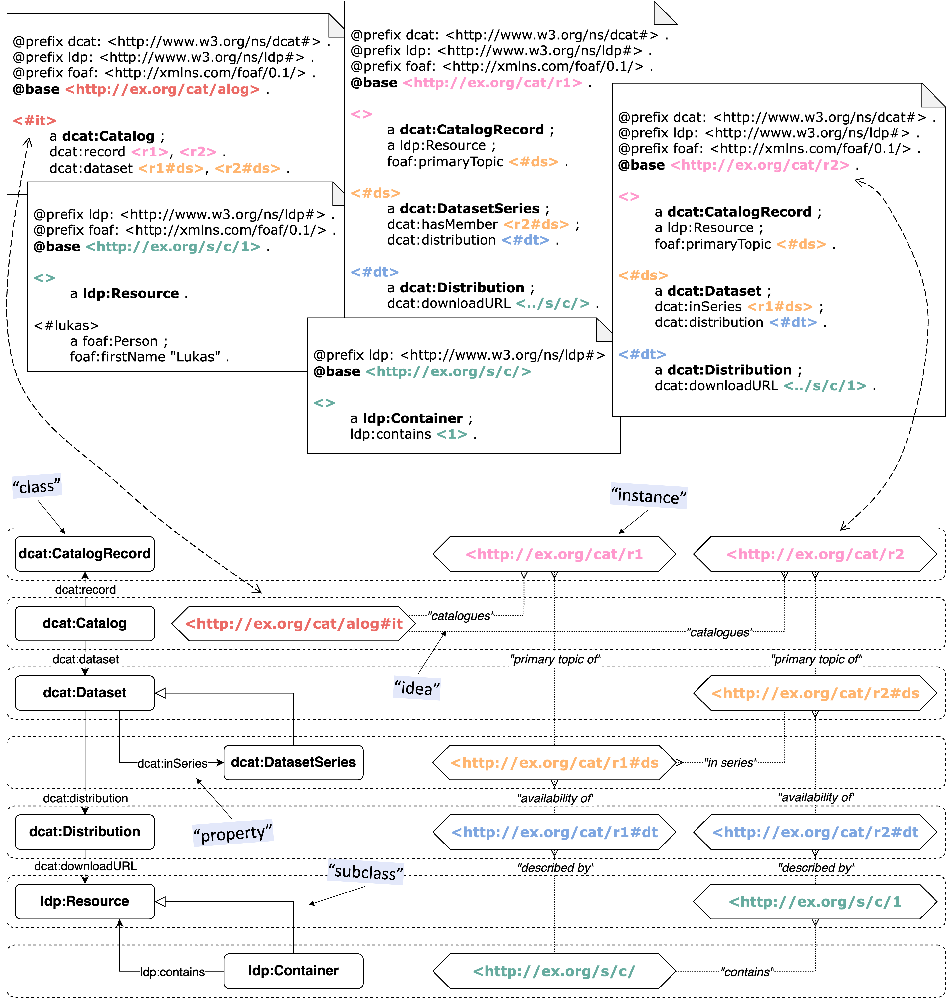
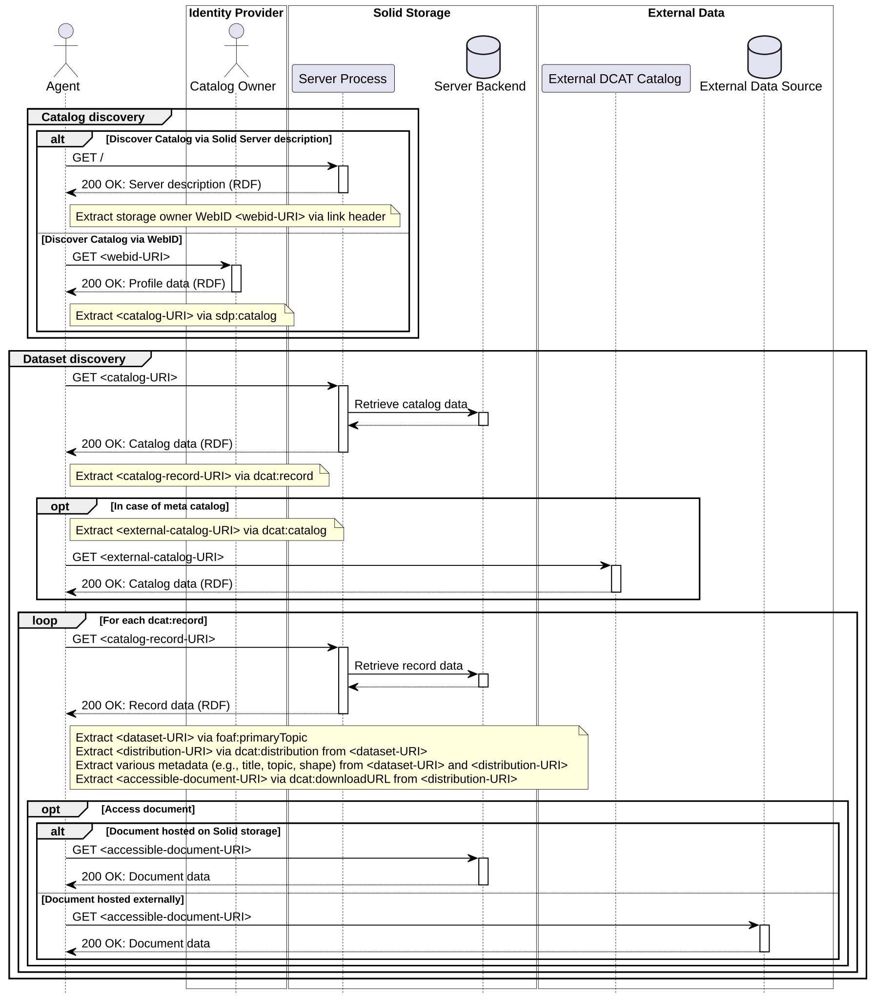

# Solid DCAT-AP

The Solid DCAT Profile provides a standards-based approach for discovering data provided in Solid storage by describing resources on the storage via the DCAT vocabulary.

## Profile Model

High-level overview of the profile model. The lower part of the figure shows how DCAT and LDP classes relate. A rectangular box with rounded edges represents a `rdfs:Class`. An arrow between classes with attached predicate expresses a `rdfs:domain` and `rdfs:range` relation. An arrow with an empty head represents a `rdfs:subClassOf` subsumption between two classes. We provide example instances and their representations. Class instances are color-coded per their class, e.g., blue for `dcat:Distribution`. With a pointy box we introduce a `rdf:type` instance of the respective class within the dotted box. Example representations for these are depicted in the upper part of the figure. The two arrows with a long dash type suggest how the upper and lower part of the figure correspond.

## Practical Flow

Practical flow of discovering catalogs and datasets. After discovering the catalog via an agent’s WebID (directly or indirectly), its records are traversed, and (meta)data is collected.

